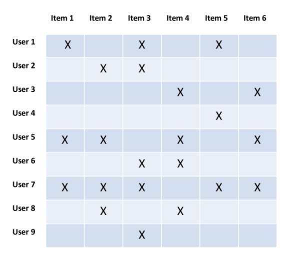
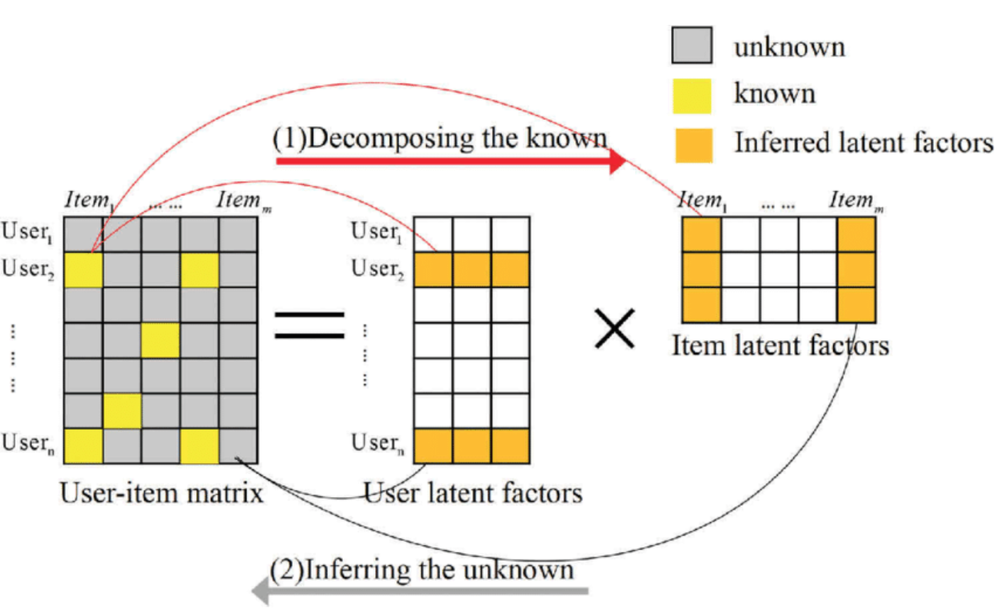

# personal_Recsys
개인화 추천

스마일게이트 모바일 게임 에픽세븐의 스토브 커뮤니티에서 개인화 추천 기능 제공

### 대상  
온스토브 에픽세븐 커뮤니티

### 범위  
 - 온스토브 에픽세븐 커뮤니티를 대상으로 로그인한 가입자에게 개인별 맞춤 컨텐츠를 제공
 - 협업필터링을 이용하여 나와 활동 이력이 비슷한 사용자가 좋아하는(read) 게시글 추천

### 추천 대상 카드  
유저가 아직 소비하지 않은 카드 중 선호할 만한 게시글의 집합을 제공

### 추천 방법론  
Matrix Factorizaion 알고리즘 중 SVD(Singular Value Decomposition)이용

### 구현방안  
 Implicit Feedback에서 선호도를 계산하여 특정한 유저/아이템간 상호작용에 대한 평점 예측  
 
### 각 컨텐츠별 선호도  
- 클릭횟수
- 좋아요
- 댓글

### MF 소개  
 - CF기반 추천 알고리즘 중 정확도가 가장 높음 (넷플릭스, 당근마켓 추천시스템 적용) 

선호도 행렬 R은 User와 Item간의 관계를 표현

### 선호도 
유저의 카드에 대한 행위를 기반으로 유저-아이템간 선호도 생성

### 선호도 계산 
1차  
 유저가 카드를 본 횟수  

2차  
 유저가 쓴 댓글  
 유저가 쓴 글  
 유저가 읽은 글의 인기도  
 유저가 누른 좋아요  

tb_preference  
 유저가 2월 한달간 읽은 카드 (유저와 유저가 읽은 카드의 인기도 상관관계)

|NO|컬럼 이름|TYPE|설명|
|---|-----------|----|--------|
|1|MEMBER_NO|INT64|스토브 유저|
|2|READ_CARD_NO|INT64|	읽은 카드|
|3|READ_CNT|	INT64|	읽은 횟수|
|4|TITLE	STRING|	카드 제목|
|5|COMMUNITY_NO|INT64|	카테고리(게시판 종류)|
|6|COMMUNITY_NM|STRING|게시판 명|

 

### 동작방식
 선호도 행렬을 user / item 개별 행렬로 분해하고 합치는 과정에서 빈곳의 선호도를 예측

 

### 조건  
 선호도 데이터 1% 이상

### Train Set  
2/1 ~ 2/28일 소셜로그에서(User Action Log) 에픽세븐 로그인 유저 읽은 건수 86만건(member_no exist) / 비로그인 유저 300만건(uuid exist)

한 유저가 2번 이상 읽은 카드 수 81,892 (전체 10%)

좋아요 건수 7,925건(로그인유저만 좋아요 클릭 가능) / 싫어요 건수 0건

댓글 건수 51,784

전체 읽은 건수 중에 유저의 선호도가 표현된 비율

14만건/86만건 = 16%
